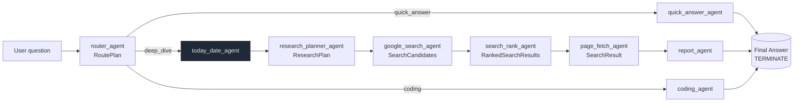

# Line AI

## Overview

Live demo: https://line-ai.up.railway.app

## Setup

### Prerequisites

- Python 3.10 (matches `backend/environment.yml`).
- Node.js 18 or newer.
- API keys for OpenAI (GPT-4o / GPT-4.1) and Serper (Google Search proxy).

### Backend

1. Create and activate a Python environment (conda: `conda env create -f backend/environment.yml`, or venv: `python -m venv .venv && source .venv/bin/activate`).
2. Install dependencies: `pip install -r backend/requirements.txt`.
3. Export required environment variables:
   - `OPENAI_API_KEY`: OpenAI project key with access to GPT-4o and GPT-4.1.
   - `SERPER_API_KEY`: Serper.dev key used for Google Search.
   - `CORS_ALLOW_ORIGIN`: Front-end origin allowed to call the API.
4. Start the API:

```
# development (from the backend folder)
cd backend && fastapi dev main.py

# production (from the repo root)
uvicorn backend.main:app --host 0.0.0.0 --port 8000
```

### Web App

1. `cd web`.
2. Copy the example environment file and point it at the API: `cp .env.example .env.local`.
   - Update `NEXT_PUBLIC_CHAT_BASE_URL` if your back end runs on a different host or port.
3. Install dependencies: `npm install`.
4. Launch the dev server: `npm run dev` (defaults to `http://localhost:3000`).

## Architectural Overview

The system consists of a FastAPI back end that orchestrates an Autogen multi‑agent workflow, and a Next.js front end that streams responses via Server‑Sent Events (SSE).

Backend

- Async‑first (`asyncio`) for high concurrency.
- Multi‑turn conversations: previous turns are kept in memory per `conversation_id`.
- Stateless clients pass the `conversation_id` from the first turn to preserve context.
- Workflow routing is implemented with Autogen GraphFlow; details below.

Frontend

- Next.js app with static pre‑rendering.
- Streams tokens from the API via SSE.
- OpenAPI schema provides type safety between front end and back end.

## Agent Workflow

The agent architecture is route‑based with three paths:

- Quick answer: Answer directly from model knowledge when sufficient.
- Deep dive: Plan searches, use Serper to gather results, rank and fetch pages, then compose a citation‑ready report.
- Coding: Specialized coding agent for programming tasks.



Agent Overview

- `router_agent`: Chooses the workflow route (`quick_answer`, `deep_dive`, or `coding`).
- `research_planner_agent`: Designs search queries, ranking budget, and page‑fetch limits for deep dives.
- `google_search_agent`: Calls Serper to produce candidate search results.
- `search_rank_agent`: Picks high‑value results and justifies each selection.
- `page_fetch_agent`: Fetches and normalizes page snippets for citations.
- `today_date_agent`: Shares the current UTC date so plans stay time‑aware.
- `quick_answer_agent`: Streams concise answers when external research is unnecessary.
- `coding_agent`: Produces code and brief explanations for programming tasks.
- `report_agent`: Writes the comprehensive response and emits the terminating token.

## AI Prompt

I used AI coding tools (Cursor + OpenAI Codex) for this assignment. Below are example prompts that illustrate my typical workflow.

1. Discuss, review, and iterate

I start by asking for a high‑level outline and design. Once aligned on the direction, I ask the agent to implement changes in small, verifiable steps (e.g., data model, backend, frontend).

```
user: I think the current messages are too specific. I’d like to simplify and generalize the message types. Many existing messages could share a single generic type. Here’s a rough outline — am I missing anything important?

agent: ...

user: Looks good—let’s proceed with the backend message type changes.

agent: ...

user: Great, now let’s update the frontend to use the new message types.
```

2. Handling knowledge gaps

LLMs may have outdated knowledge of tools and frameworks. For example, the OpenAI Codex model has knowledge of Autogen 2.x, whereas the latest Autogen is 7.x. To bridge this gap, I sometimes:

- Include an LLM‑friendly text export of the relevant docs in context.
- Provide the library source code and let the LLM infer usage.

```
I’d like to extend the current agent to add routing: a router agent inspects the user question and selects one of three branches:
- quick answer
- deep dive (web search)
- coding task

Your Autogen knowledge may be outdated—please refer to doc/graph-flow.ipynb.txt for the latest GraphFlow reference to implement this.
```

