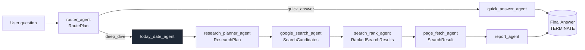

# Line AI

## Overview

Line AI is a retrieval-augmented research assistant that streams every step of its reasoning. A FastAPI back end orchestrates a structured AutoGen GraphFlow of agents, and a Next.js interface consumes the server-sent events (SSE) stream to visualise searches, page fetches, and answers in real time.

## Highlights

- Structured multi-agent workflow routing between quick answers and deep-dive research plans.
- Streaming `/chat` SSE endpoint surfacing search, rank, fetch, and answer progress updates.
- Next.js 15 web app with a timeline of agent activity, suggested prompts, and citation previews.
- Pluggable tool layer with Serper-powered Google search and HTML page fetching.

## Setup

### Prerequisites

- Python 3.10 (matches `backend/environment.yml`).
- Node.js 18 or newer.
- API keys for OpenAI (GPT-4o / GPT-4.1) and Serper (Google Search proxy).

### Backend

1. Create and activate a Python environment (conda: `conda env create -f backend/environment.yml`, or venv: `python -m venv .venv && source .venv/bin/activate`).
2. Install dependencies: `pip install -r backend/requirements.txt`.
3. Export required variables:
   - `OPENAI_API_KEY`: OpenAI project key with access to GPT-4o and GPT-4.1.
   - `SERPER_API_KEY`: Serper.dev key used for Google search.
   - `CORS_ALLOW_ORIGIN` (optional): Front-end origin allowed to call the API.
4. Start the API: `uvicorn backend.main:app --reload --host 0.0.0.0 --port 8000`.

### Web App

1. `cd web`.
2. Copy the example environment file and point it at the API: `cp .env.example .env.local`.
   - Update `NEXT_PUBLIC_CHAT_BASE_URL` if your back end runs on a different host or port.
3. Install dependencies: `npm install`.
4. Launch the dev server: `npm run dev` (defaults to `http://localhost:3000`).

### Running the Stack

- Keep the FastAPI server running on port 8000.
- Start the Next.js dev server and open http://localhost:3000.
- Ask a question—each turn renders the live agent workflow along with the final answer and citations.

## Environment Variables

### Backend

- `OPENAI_API_KEY`
- `SERPER_API_KEY`
- `CORS_ALLOW_ORIGIN` (optional, e.g. `http://localhost:3000`)

### Frontend

- `NEXT_PUBLIC_CHAT_BASE_URL` (e.g. `http://127.0.0.1:8000`)

## Architectural Overview

The back end exposes a small FastAPI surface (`backend/main.py`):

- `GET /`: Health check.
- `GET /chat/event-type`: Lists the SSE message names supported by the client.
- `GET /chat`: Streams chat progress events. Requires `user_message`, optional `conversation_id` for follow-up turns.

`backend/agent.py` builds the AutoGen GraphFlow that powers `/chat`:

1. A `router_agent` inspects the user request and emits a `RoutePlan` that chooses between a quick answer and a deep research route.
2. Quick questions stream responses directly from `quick_answer_agent` using a lightweight GPT-4.1 model.
3. Deep-dive requests trigger a research plan (`ResearchPlan`) with suggested queries, ranking and fetch limits.
4. The workflow fans out to specialist agents:
   - `google_search_agent` executes Serper queries and emits `SearchCandidates`.
   - `search_rank_agent` scores candidates and suggests the most relevant pages.
   - `page_fetch_agent` retrieves page content (trimmed to 4k characters) for citations.
   - `report_agent` synthesises the final answer, while `today_date_agent` keeps the team aware of the current date.
5. The orchestrator converts agent events to strongly typed stream messages (`backend/message.py`) so the UI can render progress, citations, and the final answer.

Because the conversation state is cached in-memory, providing the `conversation_id` returned in the first turn lets the system maintain multi-turn context.

## Agent Workflow
The router selects between a quick answer path and a deep-dive research path. The diagram below reflects the graph defined in `backend/agent.py`.

SSE events emitted along the way (for the UI): `turn.start`, `search.start`, `search.end`, `rank.start`, `rank.end`, `fetch.start`, `fetch.end`, `answer-delta`, `answer`.

## Agent Overview

- `router_agent`: Chooses the workflow route (`quick_answer` vs `deep_dive`).
- `research_planner_agent`: Designs search queries, ranking budget, and page fetch limits for deep dives.
- `google_search_agent`: Calls Serper to produce candidate search results.
- `search_rank_agent`: Picks high-value results and justifies each selection.
- `page_fetch_agent`: Fetches and normalises page snippets for citations.
- `today_date_agent`: Shares the current UTC date so plans stay time-aware.
- `quick_answer_agent`: Streams concise answers when external research is unnecessary.
- `report_agent`: Writes the comprehensive response and emits the terminating token.

Each agent can be extended or swapped—adjust their system prompts or plug in additional tools in `backend/agent.py` and `backend/tools.py`.
