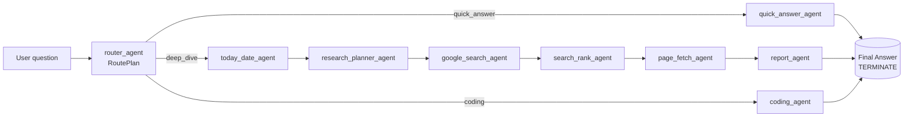

# Line AI


[Live demo](https://line-ai.up.railway.app)

Line AI is a lightweight, Perplexity‑style service that uses a multi‑agent workflow to answer user questions. It currently supports:

- Workflow routing and multi‑step execution: depending on the question, an appropriate route is selected. The three supported routes are:
  - Quick answer: respond directly from model knowledge when sufficient.
  - Deep dive: use Google Search to gather information and produce a citation‑ready report.
  - Coding: specialized coding agent for programming tasks.

Assumptions

- Conversation data is not persisted. The backend keeps recent conversation state in memory (1‑day TTL) to support multi‑turn conversations. This limits scope and keeps the project simple.

## Setup

### Prerequisites

- Python 3.10 (matches `backend/environment.yml`).
- Node.js 18 or newer.
- API keys for OpenAI (GPT‑4o / GPT‑4.1) and Serper (Google Search API proxy).

### Backend

1. Create and activate a Python environment:
   - Conda: `conda env create -f backend/environment.yml && conda activate lineai`
   - venv: `python -m venv .venv && source .venv/bin/activate`
2. Install dependencies: `pip install -r backend/requirements.txt`.
3. Export required environment variables:
   - `OPENAI_API_KEY`: OpenAI project key with access to GPT‑4o and GPT‑4.1.
   - `SERPER_API_KEY`: Serper.dev key used for Google Search.
   - `CORS_ALLOW_ORIGIN`: Frontend origin allowed to call the API.
4. Start the API:

```
# development (from the backend folder)
cd backend && fastapi dev main.py

# production (from the repo root)
uvicorn backend.main:app --host 0.0.0.0 --port 8000
```

### Web App

1. `cd web`.
2. Copy the example environment and point it at the API: `cp .env.example .env.local`.
   - Update `NEXT_PUBLIC_CHAT_BASE_URL` if your backend runs on a different host or port.
3. Install dependencies: `npm install`.
4. Launch the dev server: `npm run dev` (defaults to `http://localhost:3000`).

## Architectural Overview

The system consists of a FastAPI backend that orchestrates an AutoGen multi‑agent workflow and streams responses, and a Next.js frontend that communicates with the backend via Server‑Sent Events (SSE).

Backend

- Async‑first (`asyncio`) for concurrency.
- The API support [OpenAPI](https://www.openapis.org/) spec, allow typesafe client server interaction.
- Workflow routing implemented with AutoGen GraphFlow (details below).
- Multi‑turn conversations: previous context is kept in memory with a 1‑day TTL.

Frontend

- Next.js app with static pre‑rendering.
- Streams responses from the API via SSE.
- Use [zod](https://zod.dev/) schema, generated with on backend's OpenAPI spec, for API response validation and typesafty.

## Agent Workflow

The agent architecture is route‑based with three paths:

- Quick answer: respond directly from model knowledge when sufficient.
- Deep dive: plan searches, use Serper to gather results, rank and fetch pages, then compose a citation‑ready report.
- Coding: specialized coding agent for programming tasks.



This project uses two kinds of agents: LLM‑backed agents and custom program agents.

- LLM‑backed agents use `OpenAIChatCompletionClient` to process messages.
- Custom program agents (e.g., `today_date_agent`, `page_fetch_agent`) execute predetermined functions.

Agent Overview

- `router_agent (llm)`: chooses the workflow route (`quick_answer`, `deep_dive`, or `coding`).
- `research_planner_agent (llm)`: designs search queries, ranking budget, and page‑fetch limits for deep dives.
- `google_search_agent`: calls Serper to produce candidate search results.
- `search_rank_agent (llm)`: picks high‑value results and justifies each selection.
- `page_fetch_agent`: fetches and normalizes page snippets for citations.
- `today_date_agent`: provides the current UTC date so searches remain time‑aware.
- `quick_answer_agent (llm)`: streams concise answers when external research is unnecessary.
- `coding_agent (llm)`: produces code and brief explanations for programming tasks.
- `report_agent (llm)`: assembles the final response and emits the terminating token.

## AI‑Assisted Coding

I used AI‑assisted coding tools (OpenAI models in Cursor) for this project. No system‑level prompt was used while working on the codebase.

LLMs can have outdated knowledge of tools and frameworks. For example, some models know AutoGen 0.2 while the latest is 0.7. To bridge this gap, I sometimes:

- Include an LLM‑friendly text export of the relevant docs in context.
- Point the code agent to the library source so it can infer usage.

```
I’d like to extend the current agent to add routing: a router agent inspects the user question and selects one of three branches:
- quick answer
- deep dive (web search)
- coding task

Your AutoGen knowledge may be outdated — please refer to doc/graph-flow.ipynb.txt for the latest GraphFlow reference, or you may find the library source code here: `/miniconda3/envs/lineai/lib/python3.10/site-packages/autogen_agentchat`.
```

## Future Ideas

- Dynamic workflow graph: the current workflow is fixed with a predetermined path. It would be interesting to generate the graph at runtime.
- Evaluation loop: for some tasks, a reflection loop (writer + critic) that iterates until criteria are met could improve quality.
